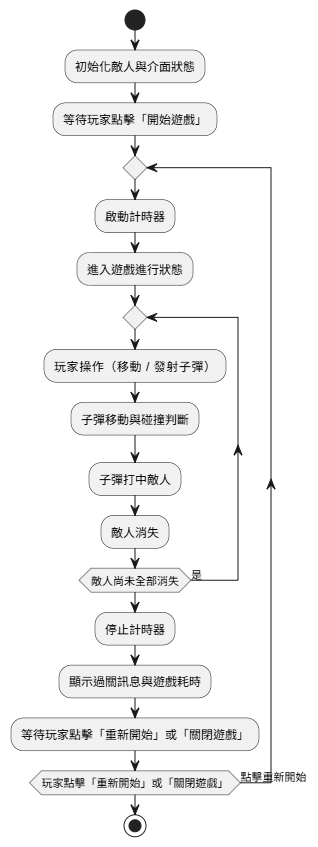

<h1 style="font-size: 28px;">Galaxian - 小蜜蜂射擊遊戲 (C# WinForms)</h1>

本專案為 C# Windows Forms 應用程式練習作品，實作一款經典小蜜蜂風格的 2D 射擊遊戲。

玩家可操控飛機左右移動與發射子彈，消滅畫面上的敵人，並搭配背景音樂與音效強化體驗。

<h2 style="font-size: 20px;">系統畫面展示</h2>

  
  
  
  

<h2>功能介紹與實作邏輯</h2>
<ul>
  <li>
    <strong>1. 飛機移動與發射子彈</strong> 
    使用 <code>A</code> / <code>D</code> 鍵控制飛機左右移動，<code>L</code> 鍵發射子彈。子彈會往上飛行並自動偵測碰撞。
  </li>
  <li>
    <strong>2. 怪物消除與過關判定</strong> 
    每個怪物為獨立 PictureBox，子彈與怪物碰撞後該怪物消失，全部怪物被清除即顯示過關訊息。
  </li>
  <li>
    <strong>3. 音效與音量調整</strong> 
    - 點擊開始／重啟按鈕播放音效 
    - 遊戲中播放背景音樂（使用內嵌資源 MP3） 
    - 可於介面調整音量（透過 TrackBar 控制 WindowsMediaPlayer 的 Volume 屬性）
  </li>
  <li>
    <strong>4. 防呆處理與結束邏輯</strong> 
    - 點擊關閉遊戲會停止 Timer 並釋放資源 
    - Bullet List 會自動清除不可見項，避免記憶體累積
  </li>
</ul>

<h2>使用技術</h2>
<ul>
  <li>圖像處理：使用 PictureBox 排列怪物、飛機、子彈，動態控制其位置與狀態</li>
  <li>音訊系統：內嵌 MP3 音效於 Resources.resx，透過 <code>WindowsMediaPlayer</code> 控制播放、音量與重複</li>
  <li>流程控制：Timer 控制時間與子彈移動，KeyDown 觸發動作，MessageBox 顯示過關提示</li>
</ul>

<h2>系統流程圖</h2>

